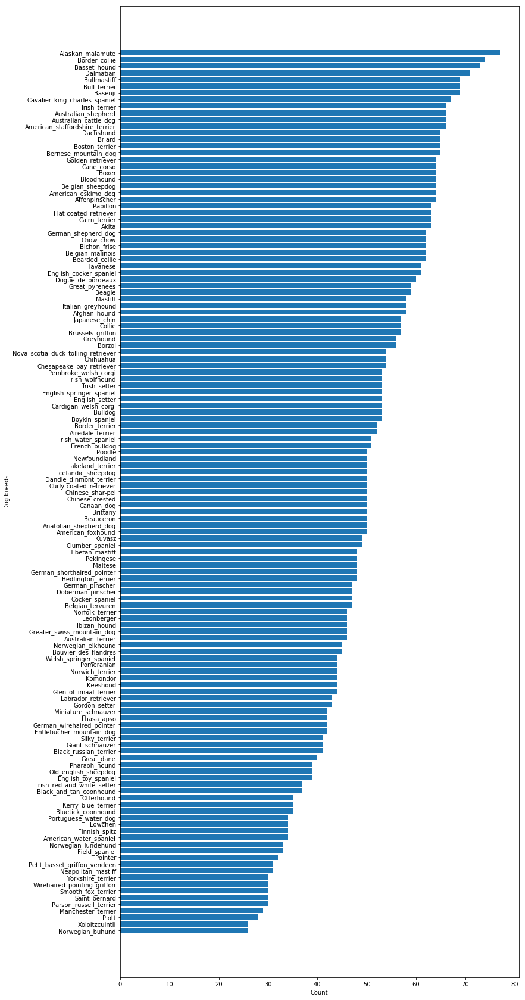

# Dog Breed Classifier 

### Project Overview: 

It's not easy to differentiate multiple dog breeds, but with an advancement of machine learning, deep learning algorithm can determine dog breeds better than human. The high accuracy will make the model be used in a mobile app to help users to know what dog breeds he is looking at. Given multiple images including multiple dog breeds, the deep learning model will be trained to classify its breeds. This will be a example of image classification task. In this project, images of different dog breeds are used to train Convolutional neural network model

### Problem Statement:

Machine Learning model is trained on the dog breed image dataset. Convolutional Neural network architecture is selected because it's proven to be good at image tasks. The NN model is optimized to minimize cross entropy loss which is a proxy metric for accuracy.

### Metrics

- Evaluation metrics: Accuracy on dog-breed labels
- Optimization metrics: Cross entropy on dog-breed labels

### Data Exploration

#### Dataset:

##### Dog images: 

- Total images: 8351 
  - Training: 6680
  - Validation: 835
  - Test: 836
- Total Categories: 133
  - Smallest number of label: ('Norwegian_buhund', 26.0) 
  - Largest number of label: ('Alaskan_malamute', 77.0)
- Image channels: 3 channel (RGB)
- Image sizes: The image sizes vary a lot
  - Smallest size: 112 x 120
  - Largest size: 4278 x 3744 

##### Label distribution:




### Methodology

#### Data preprocessing

The CNN expects the input image to be of a specific size. But the dog image dataset has a variety of image sizes. Therefore these images are resized to 224 x 224 before it's fed into the CNN model.
The usual image RGB pixel values are encoded 3 channel 8 bit values ranging from 0 to 255. For better model training, these values are usually normalised and the normalization process can depend on the dataset and model architecture. In the final model, VGG19 back-bone model is used to extract features from images, therefore VGG19 normalization process is applied to the dog-breed image dataset.

#### Implementation

- Metrics
    - Evaluation metrics: Accuracy on dog-breed labels
    - Optimization metrics: Cross entropy on dog-breed labels
- Algorithm
    - Model: Convolutional Neural Network
    - Optimization: Adam
    - As the optimization process can make the model overfit to the training dataset. This can make it tricky to find an optimal model during training is in progress. Keras framework support a convenient callback `ModelCheckpoint` which can track the metric as training progresses and stores the model state at an epoch where the model is optimal regarding the metric

#### Overall Steps 

1. The images are preprocessed as follows:
    1. The image is resized to 224 x 224
    2. The image transformed into 3-D tensors
    3. The image pixel values are normalised to conform to the backbone model's expectation
2. The backbone model (eg. VGG16/19) extracts features from the preprocessed image
3. The features are fed into the classification layer which is fine-tuned for dog-breed classification task
4. Final model is created as a composition of the backbone-model and the classification layer

#### Refinement

Initially, a fully custom CNN model is used. But because of the large search space regarding hyperparameters, model architecture and optimization algorithms, it was not easy to find a good combination showing a good performance. This fully custom CNN model achieved ~2% accuracy which is still better than random guessing but far from a usable performance.
In order to reduce the search space, previously proven model architecture is used to extract features and it's customized with final few layers for the custom task. It basically used a transfer learning from a more general image task into dog-breed classification task, reduce the search space of model architecture into a few final layers and helped improve the accuracy performance.


### Results

#### Final Model
- VGG19 model (Backbone without the fully-connected layers)
- Fine-tuned classification layers (# parameters: 165,509)
```
_________________________________________________________________
Layer (type)                 Output Shape              Param #   
=================================================================
global_average_pooling2d_2 ( (None, 512)               0         
_________________________________________________________________
dense_3 (Dense)              (None, 256)               131328    
_________________________________________________________________
dense_4 (Dense)              (None, 133)               34181     
=================================================================
```


#### Model Validation

- Accuracy on test dataset: 75.48%
- Generalization test
   - Even though the model worked well on the unseen test data. This test data comes from same dataset (with random sampling) and the general obtainable dog image might not share the charcteristic with the curated dataset. Therefore, random sample dog images are retrieved from web and used to check if the model can actullay generalize beyond the curated dataset.
   - These random samples images are stored in test_img/ and used as a simple final check on model's generalizability

#### Justification

As explored inside the jupyter notebook, It's not easy to get a good performance with the complete custom model. Transfer learning really worked well and helped improve the model performance a lot. This improvement comes from good generalizable features. In case of fully custom CNN model, image features and labels need to be learned together on the dog-breed dataset. However, the backbone-model like VGG19 is trained on much larger dataset (ImageNet) to learn generalizable good features and only the final classification layer is learned to use these features to classify dog breeds. Therefore, the learning task becomes much easier and helps the model learn well on the given labels.


### Conclusion

#### Reflection
Dog breed classification is not an easy task for human because there are a lot of breeds and sometimes the difference can be subtle to recognize. Trained ML model can help human know what breed he is looking at, because the model can learn the subtle differences and successfully classify dog breeds. In this project, CNN model and transfer learning technique is used to achieve a high accuracy on the task. The final solution is made with pretrained VGG19 backbone network and fine-tuned classification layers on dog-breed labels. A few difficulties were:

1. Huge search space in learning CNN model due to a lot of levers to tune (eg. architecture, hyperparameters, optimization algorithms)
2. Uncertainty on the data size if it's big enough to learn good visual features and dog-breed labels together

It had too many levers to consider and search when developing a fully custom model. But with transfer-learning technique, it became much easier to get a good performance on custom task because these models are already trained and tuned carefully to extract good visual features which can generalize across lot of image task domains.

#### Potential improvements

The fine-tuned classification layer achieves a much better accuracy than the custom model without a pretrained backbone. However, It wasn't be easy to achieve an accuracy over 80% with just VGG19 + Dense-layer based architecture. It can be further optimized to improve with the following methods:

1. Use more sophisticated optimization algorithm with proper hyperparameters
2. Search a better architecture for the classification layer
3. Try using more than 1 backbone pre-trained architecture

The option 3 will make the overall model more complex with more parameters than the current solution because each pre-trained NN already has a lot of parameters. Depending on a hardware spec, it might require a distributed training to train the model as it can require more memory to store model weights and data together.


## How to test web app

- Go to app directory and start the Flask api server
```bash
cd app/
python app.py
```

- Go to test_img directory and try posting a sample image to the Flask api server
```bash
cd test_img/
curl -X POST -F image=@dog_boston-terrier2.jpg http://localhost:5000/predict
```


## File Structure

- haarcascades/ : This folder contains opencv-based human face detector
- images/ : This folder contains sample images
- saved_models/ : This folder contains fine-tuned classification layer trained weights
- test_img/ : This folder contains sample images to test the model
- app/ : This folder contains simple API web-app to classify dog images
- dog_app.ipynb: Main notebook for dog_breed classificer


## Dependencies

- python packages
  - opencv-python
  - h5py
  - matplotlib
  - numpy
  - scipy
  - tqdm
  - keras
  - scikit-learn
  - pillow
  - ipykernel
  - tensorflow
  - Flask
- Linux packages
  - curl